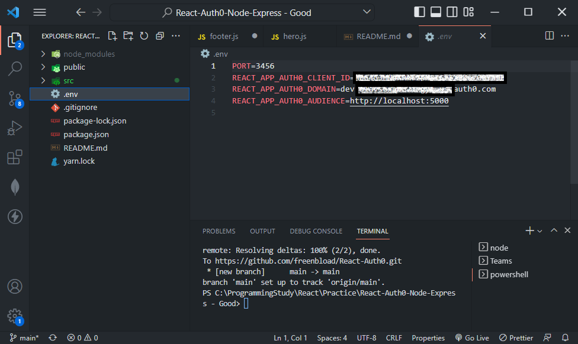

# React.js Authenticatoin and Authorization Project

## About:

This small application demonstrates authentication and RBAC for an SPA, using Auth0, JWT, Node.js, Express.js and React.js

## Tech Stack:

- Node.js/Express.js
- Auth0, JWT
- React (Create React App)
- React Router 5.2

## Screenshot

### Watch the demo video


### Home Page


### After logged in


### Profile of a logged in user


### Public API for logged in user


### User role API for logged in user


### Admin role API for logged in user - rejected


### Admin role API for logged in user - accepted


### React .env configuration



### Server .env configuration


## Software

Before proceeding, please ensure you have the following software installed on your computer.

- Node
- Git command line tools

### Useful links

- Download Git CLT - Windows: https://git-scm.com/download/windows Mac: https://git-scm.com/download/mac
- Download Node - https://nodejs.org/en/
- Download VSCode - https://code.visualstudio.com/

## Getting started

Please fork a copy of this repository. Forking a repository allows you to freely experiment with changes without affecting the original project. Alternatively download or clone the master branch.

### Download & Install Dependencies on your machine

Clone the repo to your machine

```
git clone https://github.com/freenbload/React-Auth0.git
```

### Lunch the frontend

1. Within terminal or cmd ensure you have navigated root directory of the source code you extracted and installed the dependencies

```
npm install
```

2. Run the start script

```
npm run start
```

Your app should be running at: http://localhost:3456

### Lunch the backend

1. Open a new terminal window and navigate inside the 'src\server' folder as you will need to keep the backend running in the background

```
cd ./src/server
```

2. Run the server script

```
node server.js
```

Your server should be running at: http://localhost:5000
